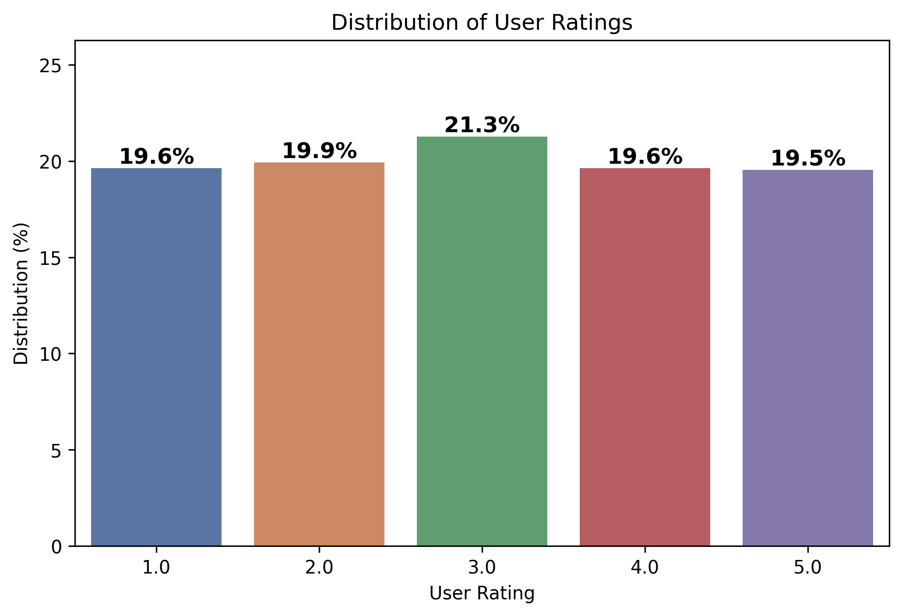

# Book Recommender

## Introduction:
This project builds a book recommendation system using the Singular Value Decomposition (SVD) model. The dataset consists of Amazon book reviews and user ratings, aiming to generate personalized and meaningful book recommendations.

The goal is to enhance user experience by offering accurate and relevant book suggestions.

## Dataset:

The dataset used for this recommendation system can be found at: [Amazon Books Reviews](https://www.kaggle.com/datasets/mohamedbakhet/amazon-books-reviews?select=Books_rating.csv)

## Objective:
- Utilize SVD to reduce data dimensionality and enhance recommendation efficiency.
- Balance the dataset to improve recommendation accuracy.
- Optimize the model for performance and scalability.

## Requirement:
Python 3.x

## Installation
Clone this repository and navigate to the project directory:

```
git clone https://github.com/BaoPhuc1311/BookRecommender.git
cd BookRecommender
```

Install required libraries using:

```
pip install -r requirements.txt
```

## Usage
Run the program using the following command:

```
python main.py
```

## Visualization:


